# Komari VI

原本仅基于主题端fork后进行简单定制，但一些想要的功能需要后端支持，且新增功能完全基于本人使用习惯进行定制，索性完全二开，避免与原作者理念、方向冲突。

本仓库基于下方原项目进行二次开发：
- [komari-monitor/komari](https://github.com/komari-monitor/komari)
- [komari-monitor/komari-agent](https://github.com/komari-monitor/komari-agent)
- [komari-monitor/komari-web](https://github.com/komari-monitor/komari-web)
- [Montia37/komari-theme-purcarte](https://github.com/Montia37/komari-theme-purcarte)

感谢原作者及所有贡献者!


## Komari 服务端

### 方式一：一键脚本安装

```bash
bash <(wget -qO- https://raw.githubusercontent.com/danger-dream/komari-vi/refs/heads/main/komari/install-komari.sh)
```

### 方式二：Docker 运行

```bash
mkdir -p ./data

docker run -d \
  -p 25774:25774 \
  -v $(pwd)/data:/app/data \
  --name komari \
  ghcr.io/danger-dream/komari:latest
```

- 默认管理账号与密码会输出在容器日志中：
```bash
docker logs komari
```
- Web 访问地址：`http://<你的服务器IP>:25774`


## PurCarte 主题

### 安装与启用

1. 前往 Releases 下载最新版 `komari-theme-purcarte.zip`。
2. 进入 Komari 后台，上传该 zip 并启用主题。


## 下载地址

- GitHub Releases: https://github.com/danger-dream/komari-vi/releases
- Docker 镜像:
  - Komari: `ghcr.io/danger-dream/komari-vi`
  - Komari Agent: `ghcr.io/danger-dream/komari-agent`

## 功能 & 截图
> 仅列出与原本有区别的部分

### 服务器
1. 后台所有涉及服务器列表的表格均有"列表"、"分组"、"地域"三种模式，方便进行筛选、过滤
2. 服务器节点列表新增在线状态显示
3. 简化编辑面板，减少录入时需要操作的步骤
4. 添加节点时，新增支持使用 ssh 自动安装 agent
5. 新增版本管理，主要用于动态切换agent版本。后续会增加自动github releases版本同步。
6. 新增部署脚本管理，方便自定义安装脚本，比如：增加一键系统初始化、一键调参、一键ss等其他一键脚本功能，以此实现购买vps后，添加节点完成就能使用的效果
7. 新增凭据管理
8. 新增连接地址管理，用于设置在不同网络环境使用不同地址下载
9. 新增隐私模式

- 节点列表

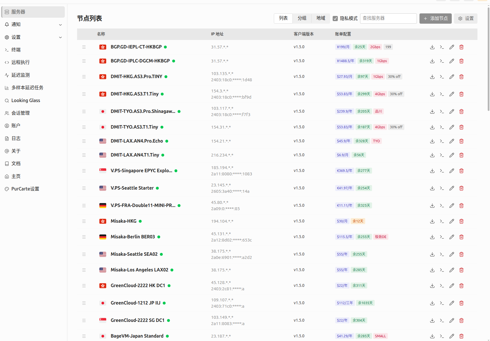

- 分组模式

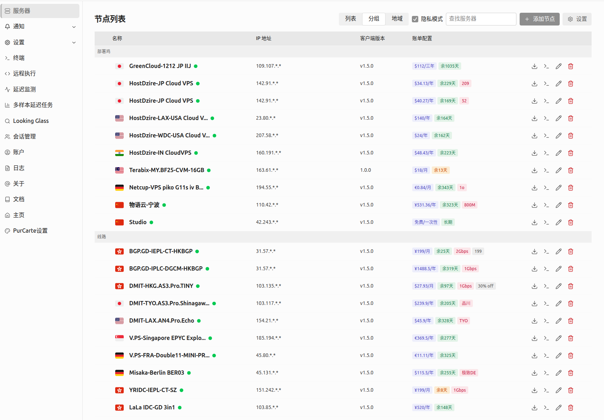

- 地域分组

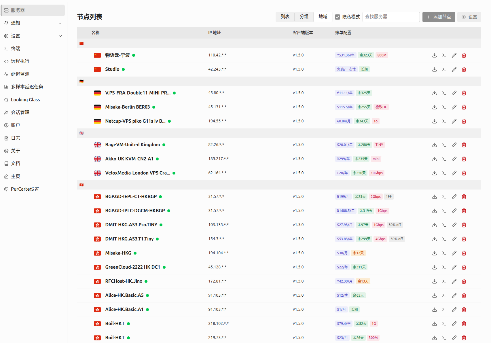

- 编辑面板


- 账单优化


- 支持自动ssh安装agent

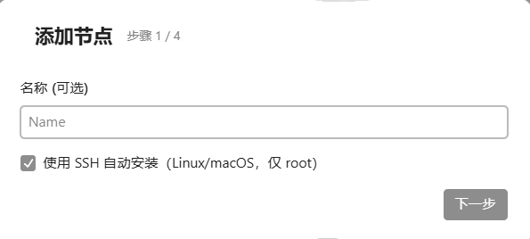


- 服务器 -> 设置 -> 版本管理


- 部署脚本管理


- 凭据管理


- 其他设置


### 终端
- 新增多标签终端模块


- 快捷命令面板


### 延迟监控
1. 任务视图新增排序、复制、隐私模式
2. 添加弹框新增按"自定义"、"从节点"、"从分组"添加

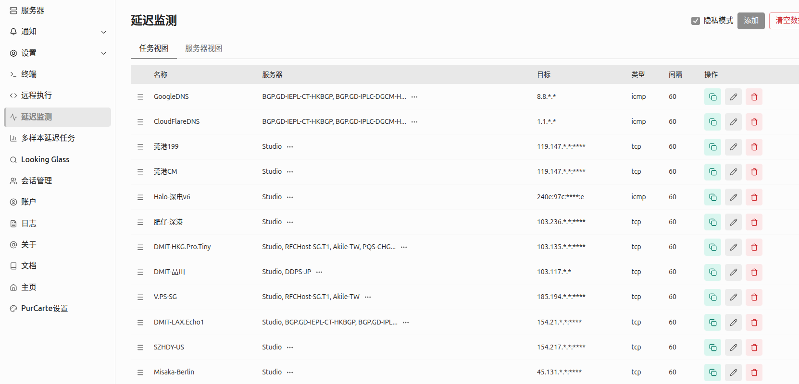
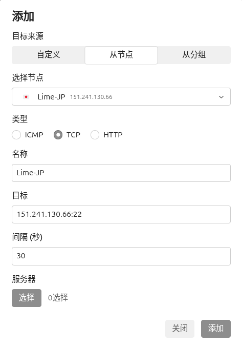
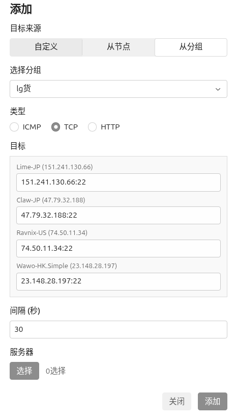

### 多样本延迟任务
1. 新增多样本延迟任务，类smokeping

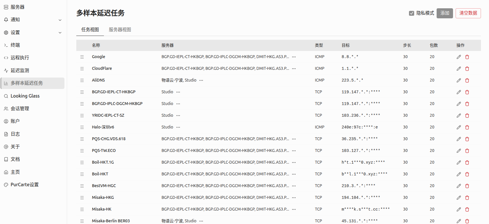
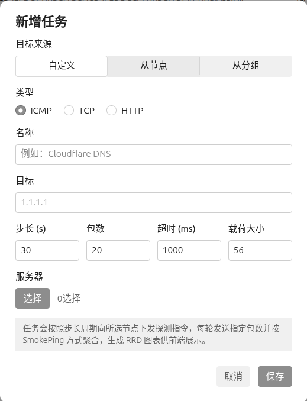
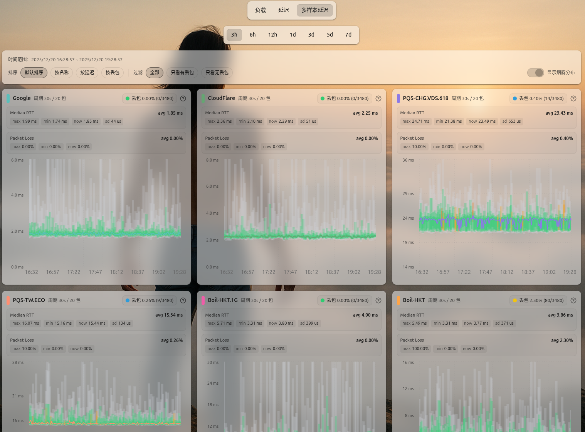

### Looking Glass


## purcarte主題

### 延迟监控
- 右上角新增延迟监控入口，用于按任务、服务器进行集中展示监控图表

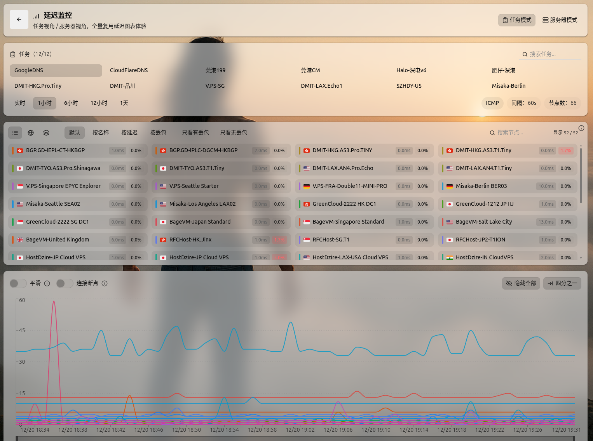
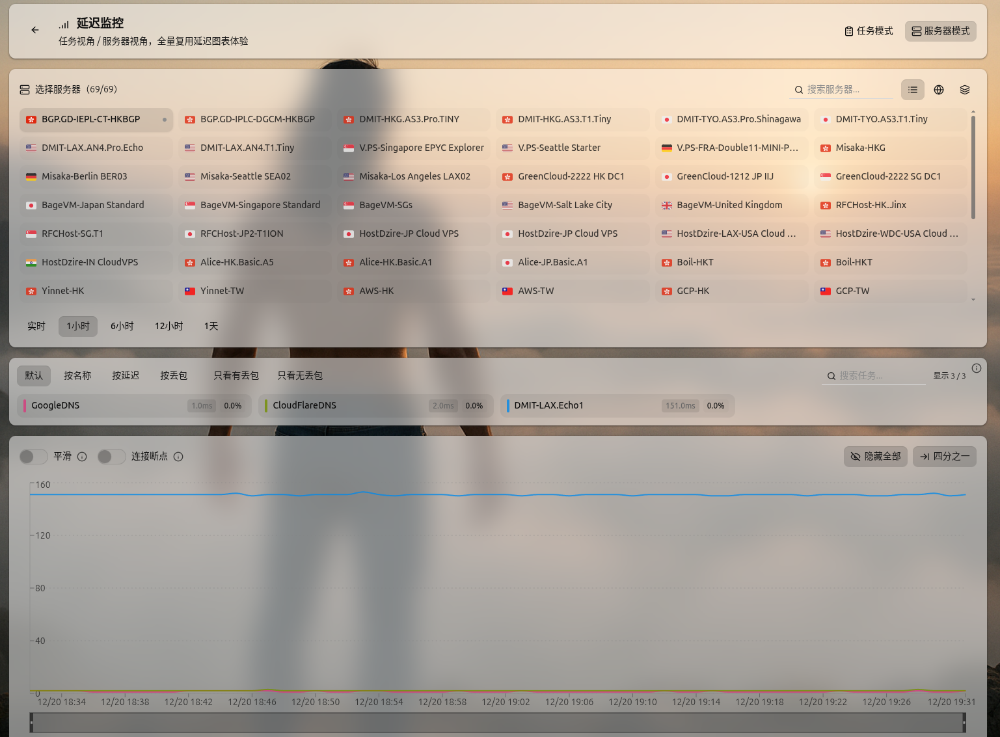

### 延迟对比
- 右上角新增延迟对比入口，基于多样本延迟任务，实现延迟对比功能

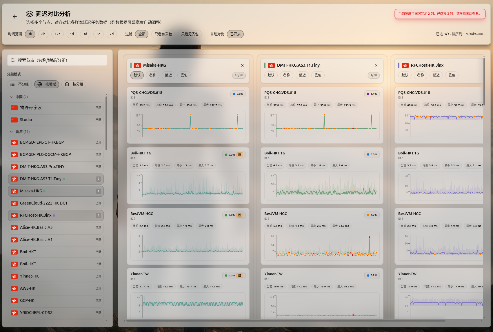
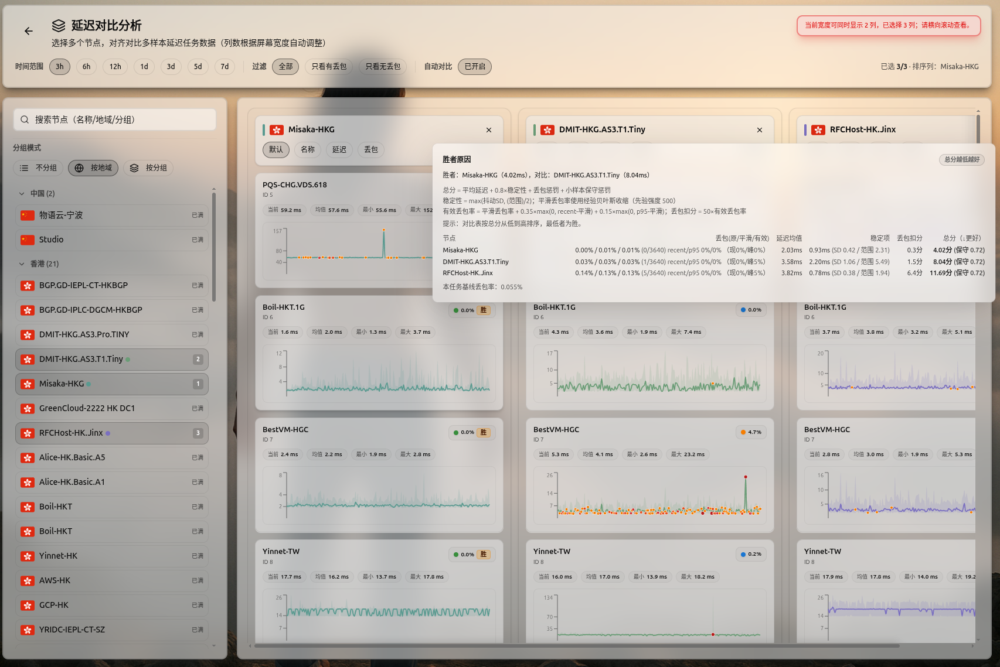

